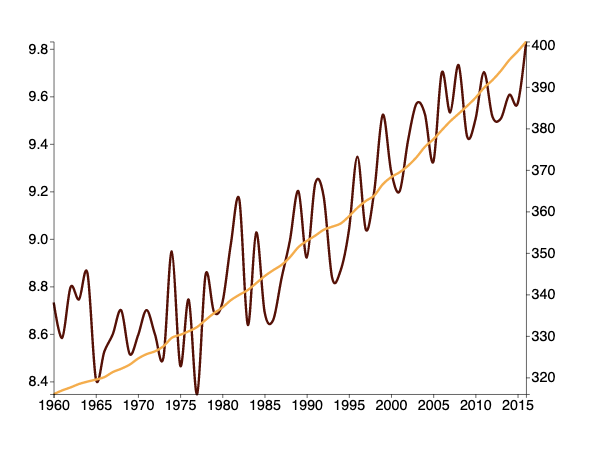

# Multiline Chart

 

In this exercise you are required to make line chart with CO2 PPM and Temperature change from 1959 to 2015

The very basic preview of the visualization should look like the figure below.

Make sure to style the visualization, and add the legends as well.

